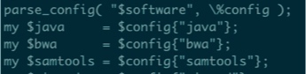

>重测序流程整理记录。

[TOC]
## 文档
安装snakemake

```bash
conda create -n py35 python=3.5
source activate py35
conda install -c bioconda -c conda-forge snakemake
```


## 命令
`nohup perl /local_data1/pipeline/Resequencing/03.SNP_INDEL_detection/Reseq_pipline_v2.pl  -step 456789 -QC -lib ./Reseq_lib.txt &`

mu01节点提交。配置文件已经设置qsub参数

**单个提交**
`qsub -cwd -l vf=10g,p=2 -q res -S /home/liyubing/bin/zsh Samples_QC_01001.sh`

**snakemake**
`snakemake --snakefile res-snake.py --cluster "qsub -q res -cwd -o o.logs -e e.logs" --jobs 8 --latency-wait 8`
9.17 version
`snakemake --snakefile res-snake.py -j 8 --cluster-config cluster.json --cluster './qsub.py' --latency-wait 8`
## 原流程
#### 各种配置文件
1. 路径/local_data1/pipeline/Resequencing/03.SNP_INDEL_detection/bin
2. cnv_caller.py有一个配置文件cnv_config.txt，里面配置脚本调用软件的路径 

#### Reseq-pipline_v2.pl
1. 配置文件里
qsub
num_threads
cpu
queue
1. 脚本中读取软件config（software.txt)路径



#### qsub-sge.pl
分样本投递，cpu。
perl流程中，每一个分析程序的调用都是这样写的（qsub是一个函数）


qsub的配置从配置文件读取

qsub函数定义
` my $job = "perl $qsub --retry 0 --lines $line --threads $nt --cpu 20 --queue $queue --vf $cpu --convert no $sh";`


`perl /local_data1/work/xiaosiwei/script/qsub-sge.pl --retry 0 --lines 1 --threads 2 --cpu 20 --queue res --vf 10G --convert no /local_data1/work/liyubing/test/03.snp_indel/snp_filter.sh`


## 新流程
1. 路径全部为绝对路径。OUT_DIR和子目录名写在文档最前面。rule中全部引用。
2. 需保证流程在OUT_DIR中运行。会有中间文件直接生成在运行目录下。比如marked_dup_metrics.txt

### 目前流程问题
**bwa 比对**
使用00preprare的fastq会报错。但使用原始的fastq.gz不会报错
参考 https://www.biostars.org/p/254155/
    
`[mem_sam_pe] paired reads have different names: "ST-E00600:400:HKT7FALXX:2:2102:32298:30937", "ST-E00600:400:HKT7FALXX:2:2102:9218:31548"`

目前流程用原始fastq gz

**breakdancer** 
软件在res 节点报错 GD模块缺失。其他节点都可以跑成功（比如rna）。
A样本报错，导致cfg为空。导致流程missing file： A.breakdancer.result

**circos**
 在res节点报错：缺少GD模块。在mu01节点可以正常出图

**delly**
mu01节点可跑。res补充库文件后也可跑。
>error while loading shared libraries: libboost_iostreams.so.1.53.0: cannot open shared object file: No such file or directory

**pindel**
log.o出来结果好像结果文件。

### 优化考虑
流程优化：
1. mapping bwa（add head）-sort 直接生成bam ok
2. snp-indel 加统计内容
3. snp注释 加内容 
4. circos 暂放 （需要sv连线 但多的话会全覆盖）
5. sv cnv 暂放（三代）

**qsub 资源设置**
可以跑4个。要看rule是否可以同时跑
qsub -l p=2

**可选择steps**
跑完后。根据需要，修改snakefile的rule all，添加新的rule的输出文件。

**logs**
方法一：
qsub.py创建logs文件夹，读取jobscript设置，获取sample名字。qsub 直接-o，-e。

```python
cmdline = 'qsub -cwd -l p={cpu},vf={mem} -q {queue} -N {jobname} -o logs/{jobname}.out -e logs/{jobname}.err '.format(cpu = cpu, queue = queue, jobname = jobname, mem = mem)
```

方法二（采用）：
rule中指定logs文件 cmd >e.log 2>o.logs
参考：https://groups.google.com/forum/#!msg/snakemake/5BRHiWUbIaA/o8mI5WZiTW0J
* 每个rule产生的rule分别生成一个文件，放在logs文件夹中。
* snakemake输出信息放在e.logs和o.logs中，注意这里的o和e是追加。最好每次跑的时候将之前的log删掉。
`snakemake --snakefile res-snake.py --cluster "qsub -l p=2 -q res -o o.logs -e e.logs -cwd" --jobs 8 --latency-wait 8 -R index`
