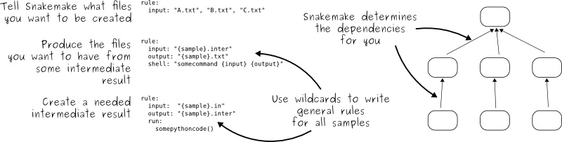

## 使用文档

requirements：
* snakemake
* python3

在python3环境中，安装snakemake。

```bash
conda create -n py35 python=3.5
source activate py35
conda install -c bioconda -c conda-forge snakemake
```

准备文件：cluster.json, samples.json, config.yaml
samples.json用samples2json.py脚本生成。


```bash
snakemake --snakefile res-snake.py -j 8 --cluster-config cluster.json --cluster './qsub.py' --latency-wait 50
```
-R 用于从某处开始重跑，与之相关的都会跑
-f 用于强制只跑某一个rule。如果不用分sample，可指定rule name。如果分sample，指定目标文件（即rule的output）
-np 打印shell 不跑


默认流程：snp，indel 变异检测结束。

可选分析 config中additional_analysis：
1. anno ： snp,indel注释，然后若也分析了sv或cnv，也增加相应注释
2. sv_software
3. cnv_software

跑完后，看结果。如果想用其他软件重跑sv或cnv，在config中修改。之后运行

```bash
snakemake -n -R `snakemake --list-params-changes
```


## 官方文档
**snakemake 原理**



**建议的框架**
```
├── config.yaml
├── environment.yaml
├── scripts
│   ├── script1.py
│   └── script2.R
└── Snakefile
```
**修改代码后，重跑改变的rule**
```python
snakemake -n -R `snakemake --list-input-changes`
snakemake -n -R `snakemake --list-params-changes`
snakemake -n -R `snakemake --list-code-changes`
```
        
**删除snamake 输出的文件** 。

仅删除rule在output中写的文件。最好先和`--dry-run `跑确认一下。同样的还有`--delete-temp-output`

```
 snakemake some_target --delete-all-output
```
例子

```python
snakemake index --delete-all-output -np --snakefile res-snake.py
```
```bash
Building DAG of jobs...
Would delete /02snakeReq/00.prepare/ref/salmonella.dict
Would delete /02snakeReq/00.prepare/ref/salmonella.fa
```

**workflow太大了，不看output，只看最终结果**

`snakemake -n --quiet`

打开zsh关于snakemake的自动完成：将以下代码放在~/.zshrc中
`compdef _gnu_generic snakemake`

**部分运行**

```bash
## 所有和这个rule相关的file都会rerun
./pyflow-ChIPseq -R call_peaks_macs2

## 重跑一个样本，只要指定target file
./pyflow-ATACseq -R 04aln/m280.sorted.bam

##只重跑align rule。
./pyflow-ATACseq -f align

```
-f
强制跑：依赖的前面没有重跑的文件亦可以跳过，只要旧文件存在就可以跑。
有wildcards的rule不能-f来跑。因为没有跑rule all，无法推断sample。
但可以指定输出文件来跑-f、

**查看结果**
```bash
snakemake --summary | sort -k1,1 | less -S

# or detailed summary will give you the commands used to generated the output and what input is used
snakemake --detailed-summary | sort -k1,1 > snakemake_run_summary.txt
```
>output_file     date    rule    version log-file(s)     status  plan

## cluster wrapper
当用--cluster参数时，snakemake处理顺序

直接提交 

`snakemake --snakefile res-snake.py --cluster "qsub -l p=2 -q res -o o.logs -e e.logs -cwd" --jobs 8`

qsub提交脚本 

`snakemake -j 2 --cluster-config cluster.json --cluster './bsub_cluster.py {dependencies}'`

**dependencies**

如果在这里`'./bsub_cluster.py -p 2'`，脚本增加如下

bsub ... `-w 'done(-p) && done(2)'` .sh

http://www.glue.umd.edu/lsf-docs/man/bsub.html

**bsub的w参数**

specifies the dependency condition of a batch job. Only when depend_cond is satisfied (TRUE), will the job be considered for dispatch.

似乎是设置job之间的联系。仅用于bsub。

snakemake根据snakefile的rule和sample拆分job，每一个job生成一个jobscript,放在临时目录中。比如
`01snaketest/.snakemake/tmp.o81t2076/snakejob.fastqc_clean.1.sh`。

每一个jobscript通过qsub提交，生成qsub命令时候，读取cluster引号内容，jobscirpt作为最后一个参数。

`bsub -n 1 -W 00:15 -u liyubing@frasergen.com -q res -J trimming-17 -o bsub_log/trimming-17.out -e bsub_log/trimming-17.err -M 16384 -R rusage[mem=16384] /local_data1/work/liyubing/projects/01snaketest/.snakemake/tmp.5qjmx_9i/snakejob.trimming.17.sh | tail -1 | cut -f 2 -d \< | cut -f 1 -d \>`

这是一个jobscript`snakejob.trimming.17.sh`的内容。

其中cluster的配置由cluster.json设置，`--cluster-config cluster.json`读入。

```bash
#!/bin/sh
# properties = {"type": "single", "rule": "trimming", "local": false, "input": ["rawData/reads/WR180002S_R1.fastq.gz", "rawData/reads/WR180002S_R2.fastq.gz"], "output": ["outData/trimmed/WR180002S_clean_R1.fq.gz", "outData/trimmed/WR180002S_clean_R2.fq.gz", "outData/trimmed/unpaired_WR180002S_R1.fq.gz", "outData/trimmed/unpaired_WR180002S_R2.fq.gz"], "wildcards": {"sample": "WR180002S"}, "params": {"trimmomatic": "/local_data1/software/Trimmomatic/Trimmomatic-0.38/trimmomatic-0.38.jar"}, "log": [], "threads": 10, "resources": {}, "jobid": 17, "cluster": {"time": "00:15", "cpu": 1, "email": "liyubing@frasergen.com", "EmailNotice": "N", "MaxMem": 16384, "queue": "res"}}

cd /local_data1/work/liyubing/projects/01snaketest && \
/local_data1/work/liyubing/software/anaconda3/bin/python3.6 \
-m snakemake outData/trimmed/WR180002S_clean_R1.fq.gz --snakefile /local_data1/work/liyubing/projects/01snaketest/Snakefile \
--force -j --keep-target-files --keep-remote \
--wait-for-files /local_data1/work/liyubing/projects/01snaketest/.snakemake/tmp.t8ndnw4x rawData/reads/WR180002S_R1.fastq.gz rawData/reads/WR180002S_R2.fastq.gz --latency-wait 5 \
 --attempt 1 --force-use-threads \
--wrapper-prefix https://bitbucket.org/snakemake/snakemake-wrappers/raw/ \
   --allowed-rules trimming --nocolor --notemp --no-hooks --nolock \
--mode 2  && touch "/local_data1/work/liyubing/projects/01snaketest/.snakemake/tmp.t8ndnw4x/17.jobfinished" || (touch "/local_data1/work/liyubing/projects/01snaketest/.snakemake/tmp.t8ndnw4x/17.jobfailed"; exit 1)
```

**简单的wrapper函数**

`read_job_properties`是snakemake自带函数，可以读取jobscript中的properties，得到一个字典。

```python
#!/usr/bin/env python3
import os
import sys

from snakemake.utils import read_job_properties

jobscript = sys.argv[1]
job_properties = read_job_properties(jobscript)

# do something useful with the threads
threads = job_properties[threads]

# access property defined in the cluster configuration file (Snakemake ≥3.6.0)
job_properties["cluster"]["time"]

print("qsub -t {threads} {script}".format(threads=threads, script=jobscript))	
```

## 其他注意
bash命令 tab需要反义;大括号需要再加一层大括号
`awk 'BEGIN{{FS=OFS="\\t"}}{{i++;print i"\\t"$0}}'`

Outputs of incorrect type (directories when expecting files or vice versa). Output directories must be flagged with directory().
`ref_split = directory(join(outdir0, "ref/ref_split"))`

当output是一个文件夹？关于snakemake自动建文件夹
好像不行。output只能是文件 才会建文件夹

>Unable to set utime on symlink /local_data1/work/liyubing/projects/02snakeReq/00.prepare/ref/salmonella.fa. Your Python build does not support it.

设置output文件来让snakemake了解分析顺序。
output文件必须是文件而不是文件夹。
后rule的input，必须承接前rule的output。目前不知道是否也要写在rule all中
snp_filter的output，和 snp_indel_anno来衔接
annovar_db的output，he snp_indel_anno来衔接
