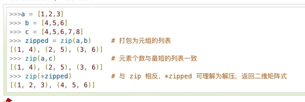
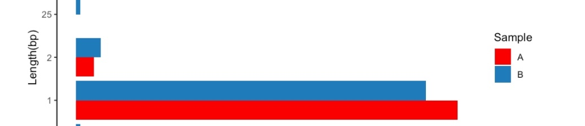

> bash，python，R的一些小功能性代码或者简单函数。学习和记录用。

## bash

for loop
```bash
for smp in *_clean
do
	for file in  ${smp}/*.png
	do
		echo $file
	done
done
```

```bash
for smp in 00.prepare/*_1.fastq
do
	name=${smp//_1.fastq/}
	echo `basename ${name}_clean` >> sample.list
done
```

`find . -maxdepth 1 -type d -name "[0-9]*" | xargs echo rm -rf`
删除所有数字开头的文件夹
m
`find ./ -type f -mtime +5 | xargs -I {} rm {}`
删除5天前的文件
```
if [[ "$group" = "FvsM" || "$group" = "SvsF" ]]; then;fi
```
语句较复杂时，一般用双方括号；括号中均有空格。变量需用引号引用。

`(head -n 1 temp && tail -n +2 temp3| sort -k1,1 -u) > ${group}_${gene}.tsv`
除去首行，其他排序去重

` svn status |  grep '\!' | cut -d\  -f2-`
-d specifies the delimeter (space), -f specifies the list of columns (all starting with the 2nd)

跳过前两列的sort
`(head -n 2 test.file && tail -n +3 test.file | sort) > newfile`

grep tab
ctrl+V tab

## python

`flat_list = [item for sublist in l for item in sublist]`


元祖的解包。
```
pp = ("a", "b", "c")
print(pp)
a,b,c = pp
```
>a b c


打印dict成tab 文件
zip中
```
my_dict = {'C1':[1,2,3],'C2':[5,6,7],'C3':[9,10,11]}
for row in zip(*([key] + (value) for key, value in sorted(my_dict.items()))):
    print(*row)
```

list里面是一个生成器。生成器和列表的差别就是，列表是中括号，生成器是圆括号。
```
list([key] + (value) for key, value in sorted(my_dict.items()))
```
>[['C1', 1, 2, 3], ['C2', 5, 6, 7], ['C3', 9, 10, 11]]
key加中括号，单独成一个list，而value本身是一个list，两个相加就合并了。



`zip(a_list)` 
将每个list的第n的元素放在第n个元祖中
`zip(*a_list)`
将每个list的

os.walk

os.walk() 方法用于通过在目录树中游走输出在目录中的文件名，向上或者向下。
os.walk() 方法是一个简单易用的文件、目录遍历器，可以帮助我们高效的处理文件、目录方面的事情。

os.walk(top[, topdown=True[, onerror=None[, followlinks=False]]])

top -- 是你所要遍历的目录的地址, 返回的是一个三元组(root,dirs,files)。

- root 所指的是当前正在遍历的这个文件夹的本身的地址
- dirs 是一个 list ，内容是该文件夹中所有的目录的名字(不包括子目录)
- files 同样是 list , 内容是该文件夹中所有的文件(不包括子目录)

```python
import os
for root, dirs, files in os.walk("./暂放", topdown=False):
    for name in files:
        print(os.path.join(root, name))
```

```bash
./暂放/1Super Simple Songs CD1.rar
./暂放/C++ Primer Plus  第6版  中文版.pdf
./暂放/生信算法finding hidden messages in DNA.pdf
./暂放/生物信息学算法导论英文版@www.jqhtml.com.pdf
./暂放/生物信息学算法导论（美）N.C.琼斯.pdf
```

脚本子进程

```
import subprocess
with open("test.txt", "w") as outfile:
    subprocess.Popen(["ls","-l"], stdout=outfile.fileno())
```

import os.path
ref_name = os.path.basename(config["ref"]) # ref.fa


将vcf文件读取python作为pandas表
```python
#!/usr/bin/env python

import io
import os
import pandas as pd


def read_vcf(path):
    with open(path, 'r') as f:
        lines = [l for l in f if not l.startswith('##')]
    return pd.read_csv(
        io.StringIO(''.join(lines)),
        dtype={'#CHROM': str, 'POS': int, 'ID': str, 'REF': str, 'ALT': str,
               'QUAL': str, 'FILTER': str, 'INFO': str},
        sep='\t'
    ).rename(columns={'#CHROM': 'CHROM'})
```
## awk
从外部传入变量
awk -v window=$window  ''
## R

dplyr:

每个样本求count百分比

```R
df <- df %>% 
    group_by(sample) %>%
    mutate(Percentage=count/sum(count))
```

ggplot当把柱状图倒过来时，legend顺序总是和图相反。



全局变量 用 <<-
sapply类，在函数内部需要用num <<- num + 1；否则，num值都是一样的

a$mean <- rowMeans(a[c('high', 'low')], na.rm=TRUE)
df中两列的均值
option 减号 直接打出 <-

colData.csv 定义好分组的先后顺序。
count.matrix的生成会来自colDData的顺序。
热图的顺序来自colData的顺序
A rule of thumb for the ‘kegg’ ID is entrezgene ID for eukaryote species and Locus ID for prokaryotes.
orgdb(包含kegg PATH信息，即ko04610这种）
SYMBOL 和 ENTREZID 是一一对应的（hsa）
ENSEMBL会多一些。 

