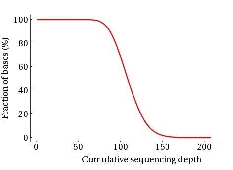

## 实际流程
### mapping（bwa）
* bwa mem 比对，加RG信息，输出bam文件
* samtools sort bam
* samtools index bam

### PCR去重复
1. picard MarkDuplicates  
dedup-reads.bam
2. picard BuildBamIndex  
改成samtools index
3. depth_addn脚本   
Depth_Cover文件夹：cumuPlot.png histPlot.png
Depth.stat
4. samtools flagstat bam  
map.stat

**depth_addn脚本**

统计：depth_frequency.txt和cumu.txt

作图：根据统计结果作图。



### snp calling
1. gatk HaplotypeCaller --emit-ref-confidence GVCF  
分样本生成raw.gvcf
2. gatk CombineGVCFs  
合并所有样本的gvcf结果 
combine——variants.vcf
3. gatk GenotypeGVCFs   
基于群体数据进行Joint genotyping  
raw_variants.vcf
4. gatk SelectVariants  
raw_snp.vcf
5. gatk SelectVariants  
raw_indel.vcf

### snp filter
**snp**
1. gatk VariantFiltration 过滤参数  
filtered_snp.vcf
2. samples_het_hom 统计脚本  
samples_snp.stat用于报告表格  

>Sample  Hom     Het     Total  
A       9       3       12  
B       9       2       11

3. samples_vcf_split  样本分开  
samples_snp文件夹：A.snp.vcf B.snp.vcf 

**indel**
同上

## 去重复

```bash
gatk MarkDuplicates -I output/E.coli/E_coli_K12.sorted.bam -O output/E.coli/E_coli_K12.sorted.markdup.bam -M output/E.coli/E_coli_K12.sorted.markdup_metrics.txt 

#4 删除不必要文件(可选)
rm -f output/E.coli/E_coli_K12.bam
rm -f output/E.coli/E_coli_K12.sorted.bam

samtools index output/E.coli/E_coli_K12.sorted.markdup.bam
```
## 术语解释
**genotyping：基因分型**  

基因分型是通过使用生物学试验检查个体的DNA序列的过程，也是将目标序列与另一个体的序列或参考序列进行比较来确定个体的遗传构成（基因型）差异的过程。

**germline**
生殖系

Germ-line的mutations 其实是来自上一代，这种mutation会随着个体整个胚胎发育过程存在，而在研究方法上，Germ-line 的 mutations 在家系分析中占有重要角色，对很多遗传病（其中包括遗传型“肿瘤”）的研究中占有重要地位。

**somatic**
体细胞。Somatic突变是不遗传的，在研究方法上主要偏重采集癌症组织和正常组织进行比较得到结果。


## GATK
文档
**GenotypeGVCFs** Perform joint genotyping on gVCF files produced by HaplotypeCaller
HaplotypeCaller Call germline SNPs and indels via local re-assembly of haplotypes
MuTect2 Call somatic SNPs and indels via local re-assembly of haplotypes
**碱基**
[参考](https://mp.weixin.qq.com/s/NXV_08mUvsJ5_RZXfwuleQ)
HaplotypeCaller得到gvcf
GenotypeGVCFs得到vcf

重比对和BQSR。没有执行BQSR是因为E.coli K12没有那些必须的known变异集（或者有但我没找到），所以无法进行；

但没有重比对，则是因为我在GATK 4.0中没发现IndelRealigner这个功能，虽然我们使用GATK HaplotypeCaller或者Mutect2的话确实可以省略这个步骤，但如果是其他软件来进行变异检测那么该步骤依然十分重要，我目前不太清楚为何GATK 4.0没有将这个功能单独分离出来。

**indel realignment**

```bash
java -jar $GATK -T RealignerTargetCreator -R $ref \
	-I ${name}.dedup.bam -o ${name}.dedup.intervals \
	--validation_strictness SILENT -nt 12

java -jar $GATK -T IndelRealigner -R $ref \
	-I ${name}.dedup.bam  -o ${name}.realigned.bam \
	-targetIntervals ${name}.dedup.intervals \
	--validation_strictness SILENT --filter_bases_not_stored
```
对 mapping 得到的 bam 文件做完 Fix Mate Information、Sort 和 mark duplicates 处理后， 就可以进入 GATK 流程了。

首先需要做 Indel realignment，其分为两步：第一步是 RealignerTargetCreator，第二步是 IndelRealigner。

GATK 文档里面提到：如果用 HaplotypeCaller 或 MuTect2 等进行局部重新组装的 caller，可以移除 Indel realignment 这个步骤。但建议如果计算资源充裕的话，这个步骤是必要的，主要原因有以下两点：

- 省略这个步骤与否，得到的 SNPs 和 Indel 数目会有少许的差异；

- 在群体遗传学研究中，不是所有的分析都是基于基因型的，例如：比较常用的 ANGSD 是以 bam 为输入文件的，做 Indel realignment 可以提高分析结果的准确性；

**Recalibrate Bases**
BaseRecalibrator 是用机器学习的方式来建立模型，以此来修正碱基质量值，可以很好的提高结果的准确性，值得大家尝试。

这个步骤对于非模式物种，以及缺少已知的、经过验证的 SNPs 和 Indels 的模式物种来说，

其它博客提到，可以同时运行 BWA + Samtools + Bcftoos 以及 BWA + GATK (无 Recalibrate Bases 步骤) 流程，经过严格的过滤后取两个结果的交集，以得到比较可靠的 SNPs 和 Indels 信息，用他们来做 Recalibrate Bases 的输入文件 (knownSites)。


**HaplotypeCaller**

```bash
java -jar $GATK -T HaplotypeCaller -R $ref \
    -I ${name}.realigned.bam \
    --genotyping_mode DISCOVERY \
    --emitRefConfidence GVCF \
    -o ${name}.snps.indels.g.vcf

java -jar $GATK -T CombineGVCFs -R $ref \
    -V 1.g.vcf -V 2.g.vcf -o Combined.g.vcg

java -jar  $GATK -T GenotypeGVCFs -R $ref \
    -V Combined.g.vcf -o all.snp.indel.vcf
```
由于我并没有做 Recalibrate Bases，故用 Indel realignment 得到的文件作为输入文件。

HaplotypeCaller 有很多优点：它可以对 mapping 结果进行局部重新组装，已得到更加可靠的变异信息。在用 gvcf 模式时，HaplotypeCaller 会对每个个体生成一个中间文件 (gvcf，其记录这个个体的变异信息)，将这些文件合并 (CombineGVCFs) 以后，可以用 GenotypeGVCFs 对多个样本进行 joint genotyping，以得到更准确的基因型。

我用 for 循环把所有的 gvcf 文件添加到参数中，这样更加简便、快捷。

如果样品较多，在合并 gvcf 文件时可以考虑合并成几个文件，把它们同时作为 GenotypeGVCFs 的输入文件。


## 参考
1. [碱基旷工：构建WGS主流程](https://mp.weixin.qq.com/s/awdjoXRYobrQAbXmAp3C0g)
2. [碱基矿工：GATK](https://mp.weixin.qq.com/s/NXV_08mUvsJ5_RZXfwuleQ)
3. [BWA + GATK 最佳实践及经验介绍](https://mp.weixin.qq.com/s/s7ujuzA93jFxRWN_T8GP_w)
4. [一个全基因组重测序分析实战](https://mp.weixin.qq.com/s/egAnRfr3etccU_RsN-zIlg)
5. [GATK 2017 hoptop](https://mp.weixin.qq.com/s/3c1rtVSP-R02CXh4TWLxAg)
6. [GATK4全基因组数据分析最佳实践](https://mp.weixin.qq.com/s/Sa019WuSg8fRQgkWAIG4pQ)