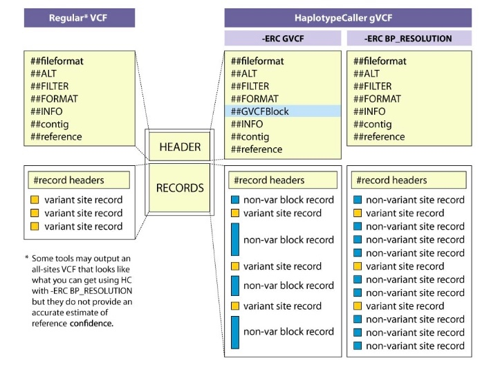
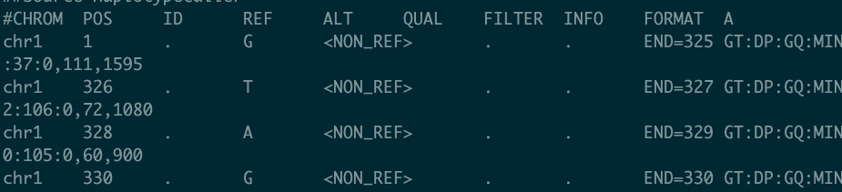
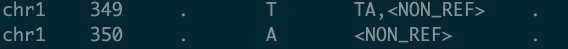
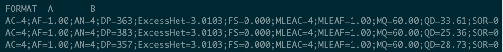
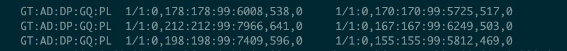

## vcf

```bash
##fileformat=VCFv4.0
##fileDate=20090805
##source=myImputationProgramV3.1
##reference=1000GenomesPilot-NCBI36
##phasing=partial
##INFO=<ID=NS,Number=1,Type=Integer,Description="Number of Samples With Data">
##INFO=<ID=DP,Number=1,Type=Integer,Description="Total Depth">
##INFO=<ID=AF,Number=.,Type=Float,Description="Allele Frequency">
##INFO=<ID=AA,Number=1,Type=String,Description="Ancestral Allele">
##INFO=<ID=DB,Number=0,Type=Flag,Description="dbSNP membership, build 129">
##INFO=<ID=H2,Number=0,Type=Flag,Description="HapMap2 membership">
##FILTER=<ID=q10,Description="Quality below 10">
##FILTER=<ID=s50,Description="Less than 50% of samples have data">
##FORMAT=<ID=GT,Number=1,Type=String,Description="Genotype">
##FORMAT=<ID=GQ,Number=1,Type=Integer,Description="Genotype Quality">
##FORMAT=<ID=DP,Number=1,Type=Integer,Description="Read Depth">
##FORMAT=<ID=HQ,Number=2,Type=Integer,Description="Haplotype Quality">
#CHROM POS     ID        REF ALT    QUAL FILTER INFO                              FORMAT      NA00001        NA00002        NA00003
20     14370   rs6054257 G      A       29   PASS   NS=3;DP=14;AF=0.5;DB;H2           GT:GQ:DP:HQ 0|0:48:1:51,51 1|0:48:8:51,51 1/1:43:5:.,.
20     17330   .         T      A       3    q10    NS=3;DP=11;AF=0.017               GT:GQ:DP:HQ 0|0:49:3:58,50 0|1:3:5:65,3   0/0:41:3
20     1110696 rs6040355 A      G,T     67   PASS   NS=2;DP=10;AF=0.333,0.667;AA=T;DB GT:GQ:DP:HQ 1|2:21:6:23,27 2|1:2:0:18,2   2/2:35:4
20     1230237 .         T      .       47   PASS   NS=3;DP=13;AA=T                   GT:GQ:DP:HQ 0|0:54:7:56,60 0|0:48:4:51,51 0/0:61:2
20     1234567 microsat1 GTCT   G,GTACT 50   PASS   NS=3;DP=9;AA=G         
```

### meta信息

井号井号后面是meta信息。一般有FILTER，FORMAT和INFO。

* 以`##FILTER`开头的行，表示注释VCF文件当中第**7**列中缩写词的说明，比如q10为Quality below 10；
* 以`##INFO`开头的行注释VCF第**8**列中的缩写字母说明，比如AF代表Allele Frequency也就是等位基因频率；
* 以`##FORMAT`开头的行注释VCF第**9**列中的缩写字母说明
* 还有其他的一些信息，文件版本"fileformat=VCFv4.0"等等。

### 各列信息

前面9列为固定列，第10列开始为样品信息列，每个样本一列，可无限列

1. `CHROM`  参考序列名称（一般是染色体编号）

2. `POS` variant所在的left-most位置(1-base position)（发生变异的位置的第一个碱基所在的位置）

3. ID  SNP/INDEL的dbSNP编号，通常以rs开头，一般只有人类基因组才有dbSNP编号

4. REF 参考基因组碱基类型，必须是A,C,G,T,N且都大写。

5. ALT 变异碱基类型，必须是A,C,G,T,N且都大写。多个用逗号分割。

6. QUAL 变异信息的检测质量值，越高越可靠。Phred格式的数值，代表着此位点是纯合的概率，此值越大，则概率越低，代表着次位点是variants的可能性越大。（表示变异碱基的可能性）

7. FILTER  标记过滤结果的列，通常我们把VCF文件中的变异信息进行质控，过滤掉低质量的变异位点，如果该位点通过过滤标准那么在该列标记为"PASS",，**则表示此位点可以考虑为variant**。标记完之后我们就可以用其他工具，把标记为"PASS"的列给筛选出来，方便后续分析。如果没有应用缺失值"."代替。

8. INFO 为附加信息列，一般以 =；形式添加额外的注释信息列，常见的如DP=18 表示该位点测序深度为18X；AF=0.1表示等位基因频率为0.1；

9. FORMAT 为后面10列信息的说明列，通常以":"隔开各个缩写词。不同的变异检测软件可能会有差异，以下用GATK的检测结果为例：
10. SAMPLES：各个sample的值，由BAM文件中的@RG下的SM标签所决定。这些值对应着第9列的各个格式，不同格式的值用冒号分开，每一个sample对应着1列；多个samples则对应着多列，这种情况下列的数多余10列。
### 第8列INFO

第8列的信息包括18种，都是以“TAG=Value”，并使用分号分隔的形式，其中很多的注释信息在VCF文件的头部注释中给出，下面对常用的TAG进行解释：

**MQ，QUAL**

MQ is the mapping quality, which is the fifth column in SAM record.  MQ is typically an indication of how unique the region's sequence is, the higher the MQ, the more unique the sequence.

QUAL, meanwhile, is the base quality score, which is derived from the 11th column in SAM record.    QUAL, is the sequencing quality, which can be platform biased, e.g. Ion seemed to have lower QUAL compared to Illumina.

**AC，AF和AN**
AC（Allele Count）表示基因型为与variant一致的Allele（等位碱基）的数目；

AF（Allele Frequency）表示Allele的频率，AF值=AC值/AN值；

AN（Allele Number）表示Allele的总数目。

比如：对2个sample的双倍体进行测序，则AN值为4。若REF上位点碱基为A，而2个sample在该位点分别为A/T和T/G，则AC值为2，1；AF值为0.50，0.25。

AC：variant数目，AF：频率，AN：总数目

**DP（reads覆盖度）**

表示reads被过滤后的覆盖度

**FS**

FisherStrand的缩写，表示使用Fisher’s精确检验来检测strand bias而得到的Fhred格式的p值，该值越小越好；如果该值较大，表示strand bias（正负链偏移）越严重，即所检测到的variants位点上，reads比对到正负义链上的比例不均衡。一般进行filter的时候，推荐保留FS<10~20的variants位点。GATK可设定FS参数。

**ReadPosRandSum**

Z-score from Wilcoxon rank sum test of Alt vs. Ref read position bias.当variants出现在reads尾部的时候，其结果可能不准确。该值用于衡量alternative allele（变异的等位基因）相比于reference allele（参考基因组等位基因），其variant位点是否匹配到reads更靠中部的位置。因此只有基因型是杂合且有一个allele和参考基因组一致的时候，才能计算该值。若该值为正值，表明和alternative allele相当于reference allele，落来reads更靠中部的位置；若该值是负值，则表示alternative allele相比于reference allele落在reads更靠尾部的位置。
进行filter的之后，推荐保留ReadPosRankSum>-1.65~-3.0的variant位点

**MQRankSum**
该值用于衡量alternative allele上reads的mapping quality与reference allele上reads的mapping quality的差异。若该值是负数值，则表明alternative allele比reference allele的reads mapping quality差。进行filter的时候，推荐保留MQRankSum>-1.65~-3.0的variant位点。

### 第10+列基因型信息

**GT**

表示genotype，通常用”/” or “|”分隔两个数字，表示同源染色体上的两个等位基因
	
0代表参考基因组的碱基类型；1代表ALT碱基类型的第一个碱基（多个碱基用","分隔），2代表ALT第二个碱基，以此类推；比如 REF列为：A， ALT列为G,T；那么0/1基因型为AG 杂合，1/1基因型为GG纯合SNP；1/2代表GT基因型；；
	
* 0/0表示sample中该位点为纯合位点，和REF的碱基类型一致
* 0/1表示sample中该位点为杂合突变，有REF和ALT两个基因型（部分碱基和REF碱基类型一致，部分碱基和ALT碱基类型一致）
* 1/1表示sample中该位点为纯合突变，总体突变类型和ALT碱基类型一致
* 1/2表示sample中该位点为杂合突变，有ALT1和ALT2两个基因型（部分和ALT1碱基类型一致，部分和ALT2碱基类型一致）

./.表示缺失。在执行GenotypeGVCFs后才会得到信息。

**AD** 
	
两种碱基各自支持的碱基数量，用","分开两个数据，分别代表两个等位基因的深度；

AD(Allele Depth)为sample中每一种allele（等位碱基）的reads覆盖度，在diploid（二倍体，或可指代多倍型）中则是用逗号分隔的两个值，前者对应REF基因，后者对应ALT基因型；

**DP** 
该样品该变异位点的测序深度总和，也就是AD两个数字的和；

(Depth)为sample中该位点的覆盖度，是所支持的两个AD值（逗号前和逗号后）的加和；例如：
1/1:0,175:175—GT:AD(REF),AD(ALT):DP
0/1:79,96:175
1/2:0,20,56:76
这里的三种类型对应的DP值均是其对应的AD值的加和，1/1的175是0+175，0/1的175是79+96，1/2的76是0+20+56

**PL** 
归一化后各基因型的可能性，通常有三个数字用','隔开，顺序对应AA,AB,BB基因型，A代表REF，B代表ALT(也就是0/0, 0/1, and 1/1)，由于是归一化之后，数值越小代表基因型越可靠；那么最小的数字对应的基因型判读为该样品的最可能的基因型；

指定的三种基因型的质量值（provieds the likelihoods of the given genotypes）；这三种指定的基因型为（0/0，0/1，1/1），这三种基因型的概率总和为1。该值越大，表明为该种基因型的可能性越小。Phred值=-10*log(P)，P为基因型存在的概率。最有可能的genotype的值为0。
例如：
0/1:889,0,216
0/1:94,0,940
1/1:269,18,0
1/1:580,54,0
1/2:3365,1522,1357,1842,0,1706
1/2:307,190,178,117,0,104
（0/0型3个数字，第一个为0
0/1型3个数字，中间为0
1/1型3个数字，最后一个为0
1/2型6个数字，倒数第二个为0）

**GQ** 
针对PL的判读得到的基因型的质量值，此值越大基因型质量值越好。由于PL归一化之后通常最小的数字为0；那么基因型的质量值取PL中第二小的数字，如果第二小的数字大于99，我们只取99，因为在GATK中再大的值是没有意义的，第二小的数大于99的话一般说明基因型的判读是很可靠的，只有当第二小的数小于99的时候，才有必要怀疑基因型的可靠性；

基因型的质量值（Genotype Quality）。Phred格式（Phred_scaled）的质量值，表示在该位点该基因型存在的可能性；该值越高，则Genotype的可能性越大；计算方法：Phred值=-10*log(1-P)，P为基因型存在的概率。（一般在final.snp.vcf文件中，该值为99，为99时，其可能性最大）
## joint calling

第一步，单独为每个样本生成后续分析所需的中间文件——gVCF文件。这一步中包含了对原始fastq数据的质控、比对、排序、标记重复序列、BQSR和HaplotypeCaller gVCF等过程。这些过程全部都适合在单样本维度下独立完成。值得注意的是，与单样本模式不同，该模式中每个样本的gVCF应该成为这类流程的标配，在后续的步骤中我们可以通过gVCF很方便地完成群体的Joint Calling；

第二步，依据第一步完成的gVCF对这个群体进行Joint Calling，从而得到这个群体的变异结果和每个人准确的基因型（Genotype），最后使用VQSR完成变异的质控。

## gvcf

gvcf里面基本保留了所有位点需要用到的信息，而且通过只记录起始(POS)和结束(END)位置的方式，使文件体积比单纯输出所有位点到vcf文件中要小的多。

gVCF 格式与 VCF 格式的关键区别在于 **gVCF 包含所有位点的记录**，也就是既包括存在变异的位点，也包括不存在变异的位点。这样做的目的是为了方便后续的群体分析（方便合并不同批次获得的变异数据）。gVCF 格式还包含每一个位点与参考基因组序列相同的可信度。两者的差异也如下图所示，可以看出 gVCF 多出很多 non-var block records。




**NON_REF**

指的应该是所有可能的碱基(包括Reference碱基)。

gvcf文件中，ALT列出现<NON_REF>



`##ALT=<ID=NON_REF,Description="Represents any possible alternative allele at this location">`

理解：gvcf作为中间文件，只保存位点开始和结束位置。另外觉得是变异的，记录为<non ref>,即认为这个位点存在一个和ref不同的碱基？？但还是有些是出来了的。



完成GenotypeGVCFs后，FORMAT增加了很多信息。10列之后的GT信息也出来了。




## 参考
1. [vcf](https://blog.csdn.net/genome_denovo/article/details/78697679)
2. [深入理解snp-calling（二）：SNP、 INDEL位点识别与过滤]()
3. [你以为的可能不是你以为的]()
4. [gvcf vs vcf](https://gatkforums.broadinstitute.org/gatk/discussion/4017/what-is-a-gvcf-and-how-is-it-different-from-a-regular-vcf)