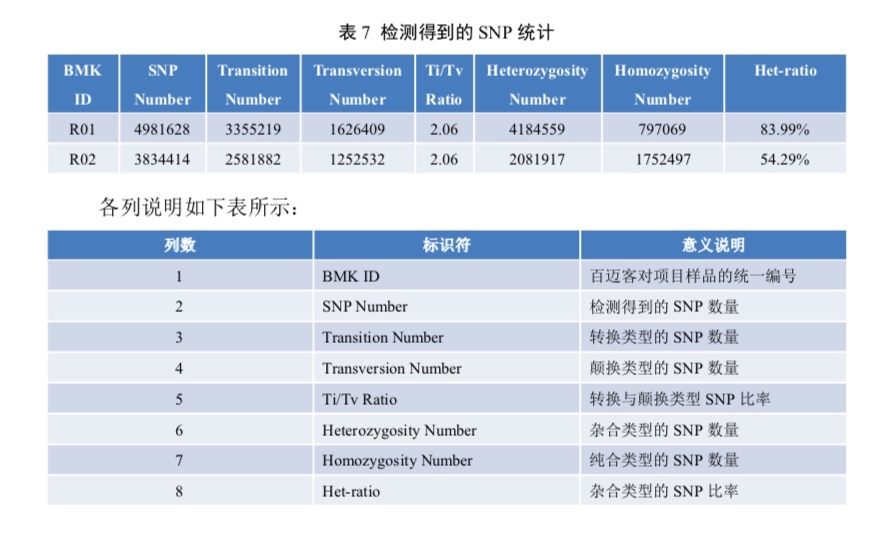
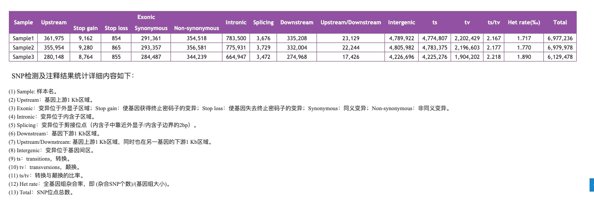
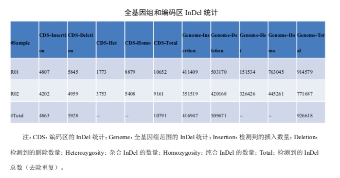
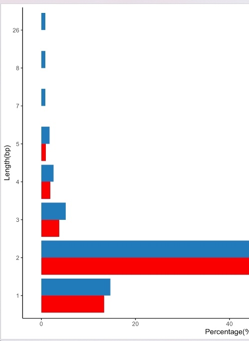

3.2.8 及以下版本的 MWeb 要更新到 3.3.1 及以上版本时，请 下载 或更新到 3.2.8 版本，然后使用菜单： MWeb - 导出偏好设置数据... 功能，导出所有设置。然后再升级到 3.3.1 版本。当升级到 3.3.1 版本后，请使用菜单： MWeb - 导入偏好设置数据... 功能，导入 3.2.8 版本导出的偏好设置数据！
## 疑问
如何拆分整体vcf
## 变异检测统计
### 软件
参考
- bcftools stats
- https://github.com/BimberLab/DISCVRSeq/
- [vcf相关的软件list](https://github.com/knausb/vcfR)
- https://vcftools.github.io/man_latest.html
- [学习vcf](https://github.com/davetang/learning_vcf_file)

杂合与纯合
第九列的第一个就是1/1 0/1 0/0
```
grep INDEL realign.vcf |perl -alne '{@tmp=split/:/,$F[9];print $tmp[0]}' |sort |uniq -c
```

### ts，tv


```
bcftools stats vcf.final.vcf -s - > test.stats
```

自己统计
`grep -v "#" A.snp.vcf|awk '$4=="A"&&$5=="G" ||$4=="G"&&$5=="A"||$4=="C"&&$5=="T"||$4=="T"&&$5=="C"{i++}END{print i}'`

## 其他
查看样本
```
bcftools query -l filtered_snp.vcf
```

将vcf按样本拆分。与流程区别在于，流程去除了没有PASS的。
`bcftools view -c1 -Ov -s A -o A.snp.vcf filtered_snp.vcf`
```
for file in *.vcf*; do
  for sample in `bcftools query -l $file`; do
    bcftools view -c1 -Ov -s $sample -o ${file/.vcf*/.$sample.vcf.gz} $file
  done
done
```

示例






### indel 统计



insertion和deletion：很简单，indel就是小片段的插入和缺失。比较REF和ALT列，长度变短的就是缺失，反之就是插入。

cds和全基因组：根据注释结果（外显子文件和全基因组文件）


## 记录
1. indel长度分布图：每个长度独立都输出。



## 参考
1. bcftools统计vcf文件中位点信息
2. https://github.com/samtools/bcftools/wiki/HOWTOs
3. 