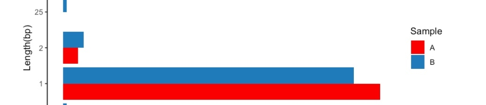

## R

标签重叠问题 ggrepel::geom_text_repel和geom_label_repel
[](https://github.com/slowkow/ggrepel/blob/master/vignettes/ggrepel.md)

颜色
scale_fill_brewer(palette = "Spectral")
scale_fill_brewer(palette = "set1")
scale_fill_manual(values=rainbow(12)) 

ggplot2 piechart
```R
df = data.frame("brand" = c("Samsung","Huawei","Apple","Xiaomi","OPPO","Other"),
            "share" = c(.1090,.0580,.0210,.4930,.0860,.2320))
# Create a basic bar
pie = ggplot(df, aes(x="", y=share, fill=brand)) + geom_bar(stat="identity", width=1)
 
# Convert to pie (polar coordinates) and add labels
pie = pie + coord_polar("y", start=0) + geom_text(aes(label = paste0(round(share*100), "%")), position = position_stack(vjust = 0.5))
 
# Add color scale (hex colors)
pie = pie + scale_fill_manual(values=rainbow(dim(df)[1])) 
 
# Remove labels and add title
pie = pie + labs(x = NULL, y = NULL, fill = NULL, title = "Phones - Market Share")
 
# Tidy up the theme
pie = pie + theme_classic() + theme(axis.line = element_blank(),
          axis.text = element_blank(),
          axis.ticks = element_blank(),
          plot.title = element_text(hjust = 0.5, color = "#666666"))
pie
```

选取第二到最后列

```R
df[, -1]
```

pie chart

```R
# Pie Chart with Percentages
slices <- c(10, 12, 4, 16, 8) 
lbls <- c("US", "UK", "Australia", "Germany", "France")
pct <- round(slices/sum(slices)*100)
lbls <- paste(lbls, pct) # add percents to labels 
lbls <- paste(lbls,"%",sep="") # ad % to labels 
pie(slices,labels = lbls, col=rainbow(length(lbls)),
   main="Pie Chart of Countries")
```

Stacked histogram from already summarized counts using ggplot2
[](https://stackoverflow.com/questions/15231109/stacked-histogram-from-already-summarized-counts-using-ggplot2)

数字的factor 按数值排序
sorted_labels <- paste(sort(as.integer(levels(df$length))))
df$length <- factor(df$length, levels = sorted_labels)

每个样本求count百分比

```R
df <- df %>% 
    group_by(sample) %>%
    mutate(Percentage=count/sum(count))
```

ggplot当把柱状图倒过来时，legend顺序总是和图相反。



全局变量 用 <<-
sapply类，在函数内部需要用num <<- num + 1；否则，num值都是一样的

a$mean <- rowMeans(a[c('high', 'low')], na.rm=TRUE)
df中两列的均值
option 减号 直接打出 <-

colData.csv 定义好分组的先后顺序。
count.matrix的生成会来自colDData的顺序。
热图的顺序来自colData的顺序
A rule of thumb for the ‘kegg’ ID is entrezgene ID for eukaryote species and Locus ID for prokaryotes.
orgdb(包含kegg PATH信息，即ko04610这种）
SYMBOL 和 ENTREZID 是一一对应的（hsa）
ENSEMBL会多一些。 


# 参考
http://www.sthda.com/english/wiki/ggplot2-barplots-quick-start-guide-r-software-and-data-visualization