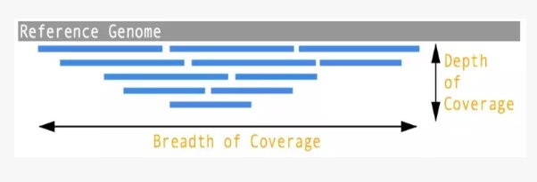
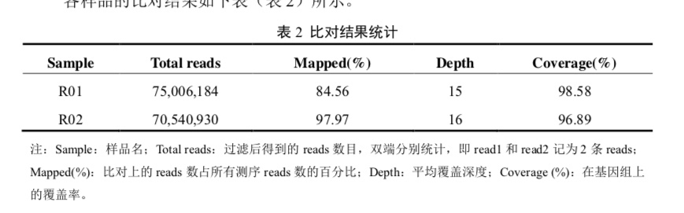
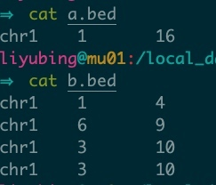

## reads覆盖度分布图 depth图

### 理论
**Depth**

测序深度是指测序得到的总碱基数与待测基因组大小的比值，可以理解为基因组中每个碱基被测序到的平均次数。测序深度 = reads长度 × 比对的reads数目 / 参考序列长度。假设一个基因大小为2M，测序深度为10X，那么获得的总数据量为20M。

我们的图是用的这个数据。

**Coverage**

覆盖度是指测序获得的序列占整个基因组的比例。指的是基因组上至少被检测到1次的区域，占整个基因组的比例。测序得到碱基数所覆盖的区域/总基因组比例。

是一个百分比。一般接近100%。






coverage覆盖度
```
Chromosome  ~~~~~~~~~~~~~~~~~~~~~~~~~~~~~~~~~~~~~~~~~~~~~~~~~~~~~~~~~~~~~~~~

BED FILE A  ***************     ***************     ******    **************

BED File B  ^^^^ ^^^^              ^^             ^^^^^^^^^    ^^^ ^^ ^^^^
              ^^^^^^^^                                      ^^^^^ ^^^^^ ^^
Result      [  N=3, 10/15 ]     [  N=1, 2/15 ]     [N=1,6/6]   [N=6, 12/14 ]
```
depth则要用总碱基数（reads长度*比对的reads数目)/总区间长度。




## samtools sort(选用）
可以用samtools，但只能统计单位点。

>-a                  output all positions (including zero depth)

>-a -a (or -aa)      output absolutely all positions, including unused ref. sequences


```bash
$samtools depth $bam -a -a > samt_depth.txt


cat samt_depth.txt | awk '
BEGIN{FS=OFS="\t"}
$2%100000==1{sum=0}
$2%100000!=0{sum=sum+$3}
$2%100000==0{sum=sum+$3;print $1,$2,sum/100000}' > depth_win.txt

```

window设定：
染色体长度5M 5M/100=50000,设为10000

## bedtools
bedtools coverage可以使用滑动窗口对区间进行统计

根据染色体长度来确定窗口和步长大小
例子1：len= 174,033,170    174M /10  窗口10M 1M
例子2：5M  / 10 = 0.5M 窗口0.1M

```
bedtools makewindows -g genome.txt -w 10000000 -s 1000000 > windows.bed
bedtools coverage -a windows.bed -b xxx.sort.bam > xxx.depth.txt
```
步长：窗口在染色体上每次向右平移距离

genome.txt为染色体，染色体长度。输出windows.bed为染色体，区间开始位点，区间结束位点。
depth.txt为染色体，区间起始，区间结束，**该区间内reads数**，区间碱基数，区间大小，**区间的平均coverage**

这里得到的7列的最后一列是平均覆盖度coverage。
如果加上参数depth，则最后一列是测序深度depth。

## 实际分析


bam文件：PCR去重复后的？ 需要sort吗


to do：如果chr太多，选择部分chr显示。

##参考 
1. [](https://blog.csdn.net/shenshenwu666/article/details/80936374)
2. [bedtools genomeconv](https://bedtools.readthedocs.io/en/latest/content/tools/genomecov.html)
3. [bedtools depth](https://bedtools.readthedocs.io/en/latest/content/tools/coverage.html)
4. [](https://www.jianshu.com/p/92d578679194)